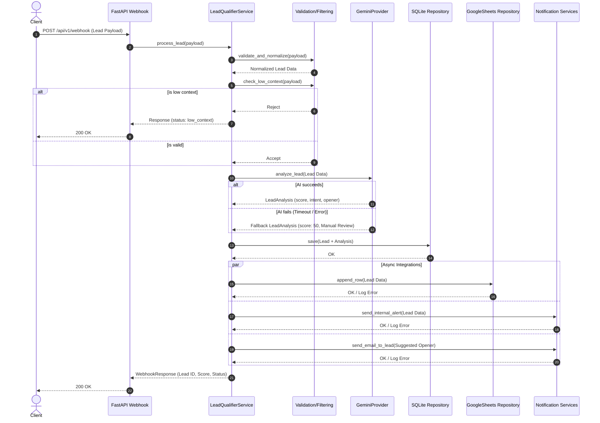

# Sequence Diagram

The following Mermaid diagram illustrates the synchronous webhook workflow for qualifying a lead.

```mermaid
sequenceDiagram
    autonumber
    actor Client
    participant API as FastAPI Webhook
    participant Service as LeadQualifierService
    participant Validator as Validation/Filtering
    participant AI as GeminiProvider
    participant DB as SQLite Repository
    participant Sheets as GoogleSheets Repository
    participant Notifications as Notification Services

    Client->>API: POST /api/v1/webhook (Lead Payload)
    API->>Service: process_lead(payload)
    
    Service->>Validator: validate_and_normalize(payload)
    Validator-->>Service: Normalized Lead Data
    
    Service->>Validator: check_low_context(payload)
    alt is low context
        Validator-->>Service: Reject
        Service-->>API: Response (status: low_context)
        API-->>Client: 200 OK
    else is valid
        Validator-->>Service: Accept
    end

    Service->>AI: analyze_lead(Lead Data)
    alt AI succeeds
        AI-->>Service: LeadAnalysis (score, intent, opener)
    else AI fails (Timeout / Error)
        AI-->>Service: Fallback LeadAnalysis (score: 50, Manual Review)
    end

    Service->>DB: save(Lead + Analysis)
    DB-->>Service: OK
    
    par Async Integrations
        Service->>Sheets: append_row(Lead Data)
        Sheets-->>Service: OK / Log Error
    and
        Service->>Notifications: send_internal_alert(Lead Data)
        Notifications-->>Service: OK / Log Error
    and
        Service->>Notifications: send_email_to_lead(Suggested Opener)
        Notifications-->>Service: OK / Log Error
    end

    Service-->>API: WebhookResponse (Lead ID, Score, Status)
    API-->>Client: 200 OK
```
